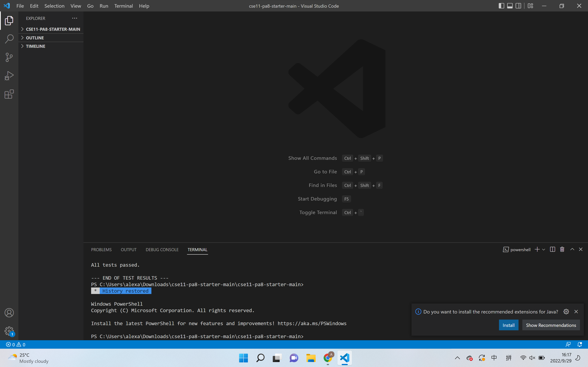
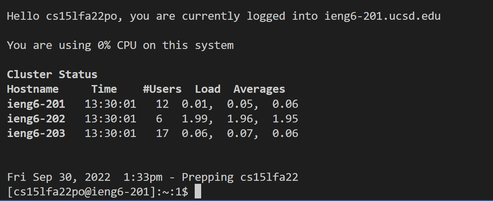
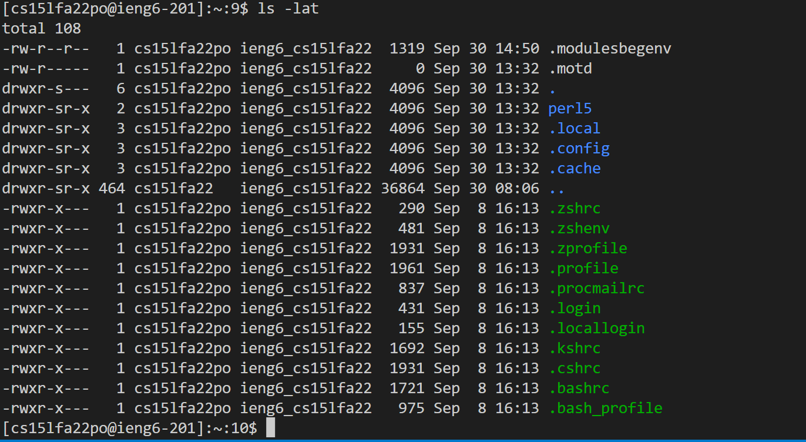

# Lab Report 1 Week 1
Hi, CSE 15L students. This is a tutotial about how to set up for remote access to the CSE lab computers.

---

>Step 1: Look up for the course-specific account on **ieng6**

[Click here to look up your acocunt](https://sdacs.ucsd.edu/~icc/index.php)

If you want to read a tutorial for resetting your password [click here](https://docs.google.com/document/d/1hs7CyQeh-MdUfM9uv99i8tqfneos6Y8bDU0uhn1wqho/edit).

>Step 2: Download Visual Studio Code

[Click here to download VSC](https://code.visualstudio.com/)


After VSC installed, open your VSC, and it should look like this:



>Step 3: Connect remotely to **ieng6**

Install OpenSSH Client

[Click here for installing OpenSSH](https://learn.microsoft.com/en-us/windows-server/administration/openssh/openssh_install_firstuse?tabs=gui)

OpenSSH allows us to connect our computer to other computers.

**ieng6** already has installed OpenSSH server.

Open a terminal in VSC, and then type in "ssh" and your account:

```
ssh cs15lfa22po@ieng6.ucsd.edu
```
My personal account is: cs15lfa22po, which is different to yours.

For the first time you connect to the server, you will be likely see something like this:

```
The authenticity of host 'ieng6.ucsd.edu (128.54.70.227)' can't be established.
RSA key fingerprint is SHA256:ksruYwhnYH+sySHnHAtLUHngrPEyZTDl/1x99wUQcec.
Are you sure you want to continue connecting (yes/no/[fingerprint])? 
```

Type `yes` and press enter, then type in your password, then you will see some thing like this:



Now, you have successfully connected to **ieng6**!

>Step 4: Try some commands

Try run some commands in both **your computer** and the **remote computer**.

* `cd ~`
* `cd`
* `cd -`
* `ls`
* `ls -lat`
* `ls <directory>`
* `cp <directory>`
* `cat <directory>`
* `exit`

This was what is shown when I ran `ls -lat`:


>Step 5: Moveing files using SSH

By using SSH, we can copy some files to the remote server:

```
scp <fileName> cs15lfa22po@ieng6.ucsd.edu:~/
```

We can create a file called `WhereAmI.java` to test it both one **our computer** and the **remote computer**. Inside `WhereAmI.java`:

```
class WhereAmI {
  public static void main(String[] args) {
    System.out.println(System.getProperty("os.name"));
    System.out.println(System.getProperty("user.name"));
    System.out.println(System.getProperty("user.home"));
    System.out.println(System.getProperty("user.dir"));
  }
}
```

`WhereAmI.java` runs on my own laptop looks like this:

After copying the file to the remote, run it on the server:

>Step 6: SSH keys

Each time we log in or `scp` a file or some files to the remote computer, we had to type in the password.  
To eliminate this time consuming issue, we can use `ssh` keys.
Now, type this on your own computer:
```
ssh-keygen
```

This command generate two keys, a private key `id_rsa` and a public key `id_rsa.pub`.
We just need to move the public key to `.ssh` directory on ther server. Log into your account and create a directory called `.ssh`:
```
mkdir .ssh
``` 

Then log out, and copy the public key to the server:
```
scp /Users/alexa/.ssh/id_rsa.pub cs15lfa22po@ieng6.ucsd.edu:~/.ssh/authorized_keys
```

We now can log in without typying in the password.

>Step 7: Optimizing remote running

* We can write a command in quotes at the end of `ssh` command to run it on the remote server, and then **exit** it.

* We can also use `;` to run multiple commands in a single line.

This is my command that can copy `WhereAmI.java` to the remote, then run it, finally exit my account.
```
scp WhereAmI.java cs15lfa22po@ieng6.ucsd.edu:~/; ssh cs15lfa22po@ieng6.ucsd.edu "javac WhereAmI.java; java WhereAmI"
```
This command only use 5 keystrokes: `ctrl + c`, `ctrl + v`, then `enter`.
After run this command once, we can use only 2 keystrokes to rerun this command: `up-arrow`, then `enter`.


